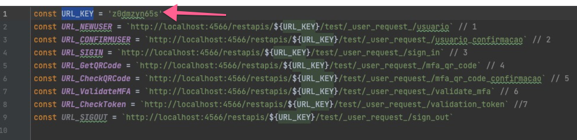

# FrontEnd FIAP Chanllenge

FrontEnd do serviço de autenticação (use case Banco Pan)

## Localização na arquitetura

# Instruções para Iniciar o FrontEnd
> Requisitos:
> * Node.js
> 
> * O Serviço do Backend precisa estar rodando antes de executar as instruções abaixo.

1. Acessar a página raiz do projeto e executar o command `npm install` para instalar as dependências.

2. Acessar a pagina de logs do container **localstack** no `Backend` e copiar o api_key.
   

3. Acessar o arquivo **HttpConstants.js** (src/httpClient/HttpConstants.js) e setar a variavel **URL_KEY**.
   

4. Executar o comando `npm start`.

5. Acessar a URL [http://localhost:3000](http://localhost:3000) no seu navegador.
